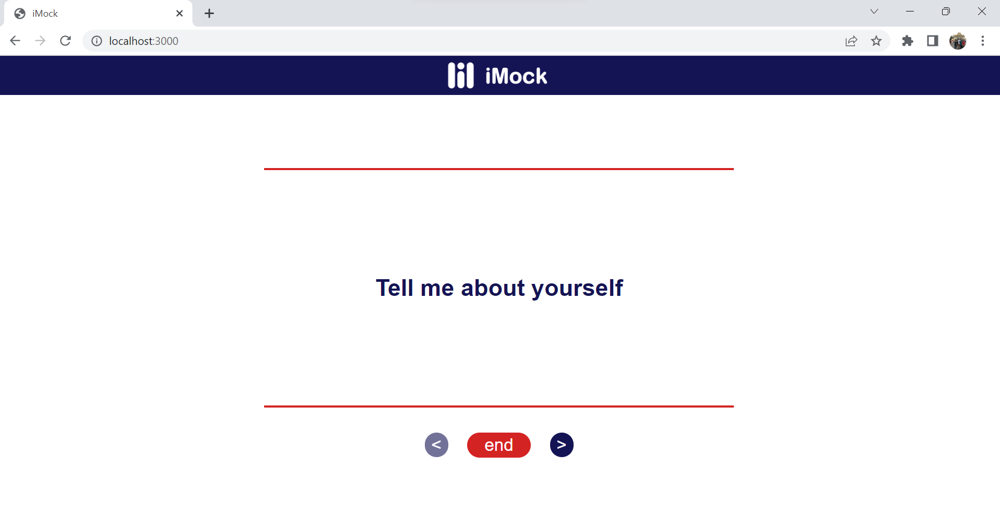

# iMock:

iMock is a web app to do mock interview by yourself

<ul>
  <li>Web Speech API is utilized in JavaScript to support text-to-speech conversion functionality.</li>
  <li>Front-end interface is implemented with HTML, CSS, JavaScript, and integrated with Google Sign-in.</li>
  <li>Back-end is built with NodeJS and hosted on Heroku cloud platform with a database in PostgreSQL.</li>
</ul>
 

 

 

 

