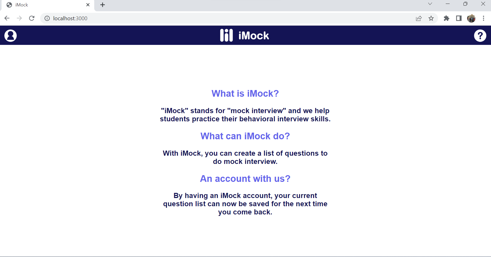
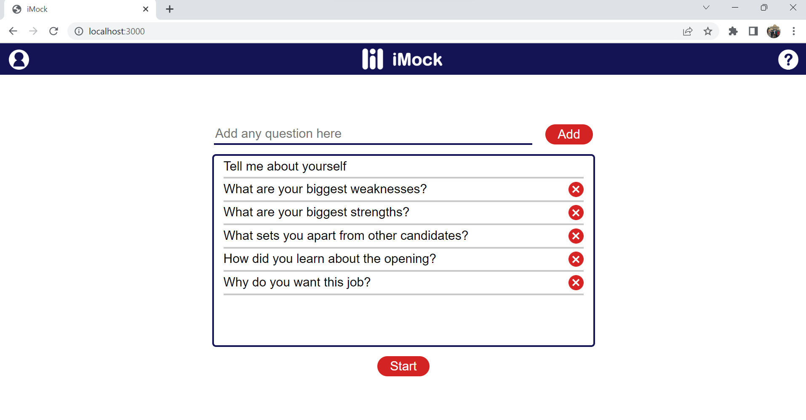
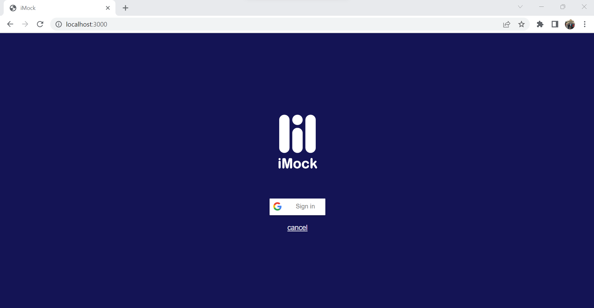

# iMock:

iMock is a web app to do mock interview by yourself

1/ backend code hosted on Heroku and built with NodeJS and PostgreSQL:

-------> server.js

2/ front end code with HTML, CSS and JavaScript:

-------> app.js

-------> style.css

-------> index.html

 

 

 

